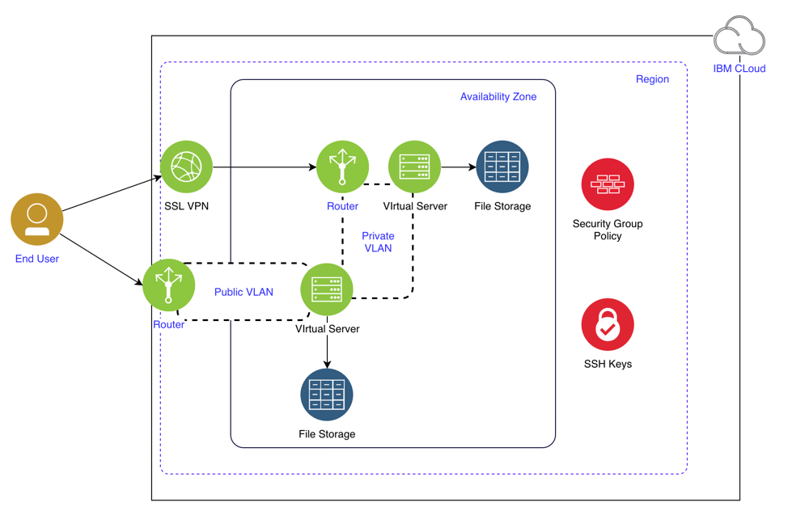

# Deploy IBM Cloud Infastructure with IBM Cloud Automation Manager

This repository contains the content for demonstrating the deployment of IBM Cloud IaaS resources using the [IBM Cloud Terraform provider](https://cloud.ibm.com/docs/terraform?topic=terraform-infrastructure-resources). 


## Architecture
The demonstration architecture includes compute, networks, storage, and security resources on IBM Cloud. 




### Components Review

Component | Description | IBM Service | Provider Resource 
--- | --- | --- | --- |--- |--- |--- |--- |--- |--- |--- |---
[VSI](https://cloud.ibm.com/docs/vsi/vsi_index.html#getting-started-tutorial) | Virtual server instance. One or more virtual servers deployed as multi-tenant instances into two availability zones. | Public VSI | ibm_compute_vm_instance 
[File storage](https://cloud.ibm.com/docs/FileStorage/index.html#getting-started-with-file-storage) | Two instances deployed as a common storage services for the virtual servers in that zone. | File Storage | ibm_store_file
[Security group](https://cloud.ibm.com/docs/vsi/vsi_index.html#getting-started-tutorial) | Two groups. One group with policies for the virtual servers attached to the public network that allows limited messages on that network. A second group with policies for all virtual servers to limit communications between virtual servers on the private network. | Security Group | ibm_security_group ibm_security_group_rule
[VLAN](https://cloud.ibm.com/docs/vsi/vsi_index.html#getting-started-tutorial) | Virtual Local Area Network. Public allows communications to the public internet. Private limits communications between the virtual servers and resources on that network. | Public or Private VLAN | ibm_network_vlan
[Zone](https://cloud.ibm.com/docs/overview?topic=overview-locations&locale=en) | A physical area of a region that supports high availability. | Data Center | availability_zone
[Region](https://cloud.ibm.com/docs/overview?topic=overview-locations&locale=en) | A geographic region where an availability zone is located. | IBM Cloud Region | e.g. us_south, us-east
[SSH Key](https://cloud.ibm.com/docs/ssh-keys/index.html#getting-started-tutorial) | SSH keys are used by SSH servers to identify a user or device through public-key cryptography. SSH-key-authorized users can add, edit, or delete SSH keys by using the IBM Cloud infrastructure customer portal. | Open VPN | ssh_key
[SSL VPN](https://cloud.ibm.com/docs/iaas-vpn/about-vpn.html#ssl-vpn-subnet-limit) | Virtual server instance. One or more virtual servers deployed as multi-tenant instances into two availability zones. | SSL VPN | sslvpn


## Content
The terrafrom scripts for this demonstration deploy a basic pattern of virtual machines as multi-tenant instances and provides for increaing the number of virtual servers at deployment time. 

- [Terraform Files](./terraform)

```
- main.tf
- access_control.tf
- storage.tf
- security.tf
- compute.tf
- variables.tf
- output.tf
- camtemplate.json
- camvariables.json
```

### Terraform files Review

This section will walk through the content in each of the Terraform configuration files. They use the IBM Could Provider for Terraform plug-in for determining what is written in each code block. You step through each of the files in the GitHub repository.

1.	[main.tf](./terraform/main.tf)
This file declares which Terraform providers are used in this configuration and provides any provider-specific information. 

2.	[access_control.tf](./terraform/access_control.tf)
This file creates a new SSH key from argument values and enters it into the IBM Cloud SSH key store. It can be reused as necessary. In this configuration, it will be used for all of the deployed virtual servers. It requires a public SSH key. 

3.	[storage.tf](./terraform/storage.tf)
This file contains the information to create two NFS-based file storage instances in the same data center. It is then mounted to each of the virtual servers deployed. 

4.	[security.tf](./terraform/security.tf)
This file contains the blocks to create two security groups and associated security policies. Each are used to limit communications of associated virtual servers on the public and private networks, respectively. The security group rules manage ingress and egress traffic to the virtual server instance.

5.	[compute.tf](./terraform/compute.tf)
This file contains the blocks to create two sets of virtual servers with the following properties:
•	the total number of virtual servers is based on the **compute_count** variable
•	the naming convention for the hostname produces unqiue names that are based on indexing from the count values
•	the file storage and SSH key values refer to the ID of the storage an ID for each resource that is produced in the previous block
•	An ID for each resource, which will be referenced in the following syntax: **{resource_type}.{resource_name.id}**. See the **file_storage_ids** in this block

6.	[variables.tf](./terraform/variables.tf) 
This file contains the variables used by the .tf files. This pattern can be parameterized to be deployed to multiple data centers or regions, or to accommodate resources (i.e. VLANs).

6.	[outputs.tf](./terraform/outputs.tf) 
This file contains the important output variables that can be queried after the terraform deployment and displayed in the Cloud Automation Manager user interface.

7. [camvariables.json](./terraform/camvariables.json)
This file contains metadata describing how each variable is presented in the Cloud Automation Manager user interface.

8. [camtemplate.json](./terraform/camtemplate.json)
This file contains metadata which provides information such as the short/long name, description, version and more for presentation in the Cloud Automation Manager Catalog. 

**Note**: Terraform doesn’t execute the code blocks in the file in order of appearance. Rather, it loads all to memory and determines the order to run based on explicit and implicit dependencies. For example, the virtual server blocks require the storage and SSH keys in place.
